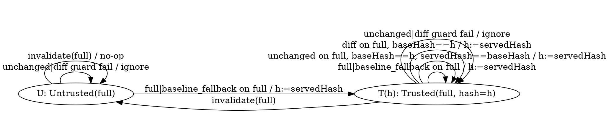
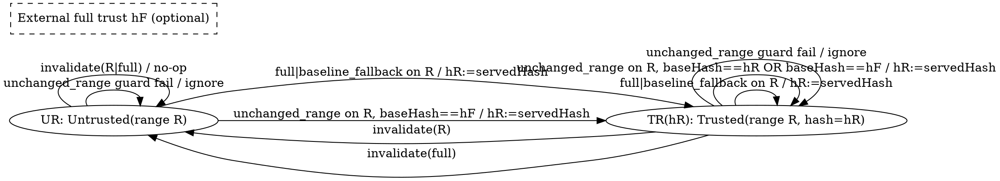

# pi-readcache — Canonical Implementation Specification

This document defines the end-to-end implementation of `pi-readcache` with correctness-first behavior for pi session trees (`/tree`, compaction, fork, resume, switch), selective reads, and concurrent sessions.

It is intentionally strict: if correctness is uncertain, serve normal full read output.

---

## 1) Scope and objective

`pi-readcache` is a pi extension that overrides the built-in `read` tool while preserving compatibility.

Required behavior:
- First read of a file/scope in current active context -> full output (baseline read behavior)
- Subsequent read of same file/scope and same content -> compact unchanged marker
- Subsequent read with changed content -> compact diff for full-file scope, safe fallback for range scope
- Fully correct across:
  - `/tree` navigation to arbitrary points
  - compaction boundaries
  - `/fork`, `/resume`, session switches
  - restart/resume

Non-goal:
- It is not a transport/protocol cache. It is context-aware read-state optimization.

---

## 2) Hard correctness invariants (non-negotiable)

1. Tool contract compatibility:
   - Tool name remains `read`
   - Input schema remains `{ path: string; offset?: number; limit?: number }`
   - Output shape remains read-compatible (`content`, optional `details.truncation`)

2. Context-safety rule:
   - Never emit `unchanged`/`diff` unless a valid base hash is provably present in current active branch context for the requested scope.

3. Uncertainty rule:
   - On ambiguity or failure (missing base, parse error, store error, diff failure), return baseline full read output.

4. Branch correctness rule:
   - Canonical read-state must be derived from current branch history, not from a mutable global pointer table.

5. Scope correctness rule:
   - Read-state is scope-aware:
     - `full`
     - `range(start,end)`

6. Persistence safety rule:
   - Any shared file write must be atomic.

---

## 3) Canonical architecture

### 3.1 Canonical truth

Canonical knowledge = replay of `read` tool metadata from session entries on current active branch path.

Use `ctx.sessionManager.getBranch()` as source, filtered by context boundary rules (Section 7).

### 3.2 Supporting store

External object store for content snapshots by hash:

```text
<repo>/.pi/readcache/
  objects/
    sha256-<64hex>.txt
  tmp/
```

This store is **supporting data** for diffing. It is not canonical context truth.

### 3.3 Optional performance cache

In-memory memoization keyed by `(sessionId, leafId, compactionBoundaryId)` + in-flight overlay.

Performance cache is disposable. Never trust it as source of truth.

---

## 4) Tool metadata contract (embedded in tool result details)

Add a compact namespace under tool result `details`:

```ts
interface ReadCacheMetaV1 {
  v: 1;
  pathKey: string;        // canonical absolute (or canonical realpath fallback)
  scopeKey: string;       // "full" | `r:${start}:${end}`
  servedHash: string;     // hash of current content served against
  baseHash?: string;      // hash used as comparison base (if any)
  mode: "full" | "unchanged" | "unchanged_range" | "diff" | "baseline_fallback";
  totalLines: number;
  rangeStart: number;
  rangeEnd: number;
  bytes: number;
}

interface ReadToolDetailsExt {
  truncation?: unknown;      // preserve built-in shape
  readcache?: ReadCacheMetaV1;
}
```

Rules:
- Keep metadata tiny and deterministic.
- Do not store large payloads in metadata.
- Do not rely on any metadata except `details.readcache.v === 1` with valid fields.
- Validation requirements by mode:
  - `mode in {"full", "baseline_fallback"}`: `baseHash` is optional.
  - `mode in {"unchanged", "unchanged_range", "diff"}`: `baseHash` is required and must be non-empty.
- Metadata parsing must be fail-open for replay:
  - invalid metadata is ignored (never throws),
  - ignored metadata must not create trust.

Persistent invalidation entry schema (for explicit refresh):

```ts
interface ReadCacheInvalidationV1 {
  v: 1;
  kind: "invalidate";
  pathKey: string;
  scopeKey: string; // "full" | `r:${start}:${end}`
  at: number;
}
```

Store this via `appendCustomEntry("pi-readcache", { ... })` when refresh is requested.
These invalidation entries are replayed with branch history and become canonical for that branch.

---

## 5) Path and range normalization

### 5.1 Path normalization parity

Path behavior must match built-in `read` semantics in pi:
- strip leading `@`
- expand `~` / `~/...`
- normalize unicode spaces as in built-in path utils
- support macOS screenshot variants (AM/PM narrow space, NFD, curly quote variants)
- resolve relative paths against `ctx.cwd`

Implement this in `path.ts` mirroring pi behavior.

### 5.2 `path:start-end` parsing

The model may emit range shorthand in `path`.

Parse rules:
1. If `offset` or `limit` explicitly present, do not parse suffix.
2. Try resolve raw path as-is. If it exists, keep as path (no suffix parse).
3. Else parse trailing `:<n>` or `:<n>-<m>`.
4. Resolve candidate path before suffix. Parse only if candidate exists.
5. If both forms are ambiguous, prefer raw path-as-file.

Validation:
- line numbers must be positive integers
- if end < start -> reject with clear error
- `offset` beyond EOF -> match built-in read error semantics

Range canonicalization:
- `start = offset ?? 1`
- `end = limit ? start + limit - 1 : totalLines`
- clamp `end` to `totalLines`
- `scopeKey = full` when range spans entire file exactly, else `r:start:end`

---

## 6) Text eligibility and fallback policy

Optimization applies only to normal text files.

Always delegate to baseline read when:
- image/supported binary type
- UTF-8 strict decode fails
- file too large for safe diff path (configurable thresholds)
- signal aborted
- any internal failure

Baseline read is created from pi SDK factory and remains behavior-compatible.

---

## 7) Branch replay and context boundary rules

Given current branch entries (root -> leaf):

```ts
const branch = ctx.sessionManager.getBranch();
```

Build active read knowledge map by replaying `readcache` metadata in branch entries, starting from a context-safe boundary.

### 7.1 Boundary selection

Find latest `compaction` entry on path.

If none:
- replay from root

If found:
- replay start is always `index(latestCompaction) + 1`
- `firstKeptEntryId` is intentionally ignored for trust replay

Rationale:
- enforce a strict post-compaction trust barrier on the active branch
- prevent any pre-compaction trust from establishing post-compaction `unchanged`/`diff`
- keep trust replay policy explicit and deterministic across compaction layouts

### 7.2 Trust-state replay model

Replay produces a **trust map**, not a raw hash map. Trust is only established/advanced by valid transitions.

Per path, maintain trust entries with sequence freshness:

```ts
interface ScopeTrust {
  hash: string;
  seq: number; // replay sequence index, monotonic within replay window
}

type KnowledgeMap = Map<pathKey, Map<scopeKey, ScopeTrust>>;
```

`seq` is used to resolve freshness when multiple candidate bases exist (for range reads).

Representation note:
- The canonical conceptual model is defined in Section 7.5 (`PathTrustState` with `full` + `ranges`).
- A flattened runtime map (`KnowledgeMap`) is allowed as long as it is semantically equivalent to the Section 7.5 state machine.

### 7.3 Replay transition rules (authoritative)

Process replay window entries in order (`seq` increments per encountered valid `ReadMeta` event). Invalidation events mutate trust but do not require their own sequence increments.

Mode classes:
- **Anchor modes**: `full`, `baseline_fallback` (can establish trust from empty state)
- **Derived modes**: `unchanged`, `diff`, `unchanged_range` (must validate base-chain trust first)

#### A) Read tool results (`message -> toolResult(read)` with valid `details.readcache`)

Let:
- `M = mode`
- `S = scopeKey`
- `H = servedHash`
- `B = baseHash`
- `Tfull = trust(pathKey, "full")`
- `Trange = trust(pathKey, S)` when `S` is a range scope

Transitions:

1. Anchor modes (establish trust)
- If `M in {"full", "baseline_fallback"}`:
  - set `trust(pathKey, S) = { hash: H, seq }`

2. Full unchanged (derived, guarded)
- If `M == "unchanged"` and `S == "full"`:
  - apply only if `B` exists, `Tfull` exists, `Tfull.hash == B`, and `H == B`
  - then set `trust(pathKey, "full") = { hash: H, seq }`
  - else ignore

3. Full diff (derived, guarded)
- If `M == "diff"` and `S == "full"`:
  - apply only if `B` exists, `Tfull` exists, and `Tfull.hash == B`
  - then set `trust(pathKey, "full") = { hash: H, seq }`
  - else ignore

4. Range unchanged (derived, guarded)
- If `M == "unchanged_range"` and `S` is range:
  - apply only if `B` exists and one of:
    - `Trange` exists and `Trange.hash == B`, or
    - `Tfull` exists and `Tfull.hash == B`
  - then set `trust(pathKey, S) = { hash: H, seq }`
  - else ignore

5. All other combinations
- ignore (no trust mutation)

#### B) Explicit invalidations (`custom` entry with `kind: "invalidate"`)

- if `scopeKey == "full"`:
  - delete full trust for `pathKey`
  - delete all range trusts for `pathKey`
- else:
  - delete only that range trust

Later replay events can re-establish trust through anchor/guarded transitions.

### 7.4 In-flight overlay

Because tool result persistence timing may lag within the same agent turn, maintain in-memory overlay:
- after successful read execution, overlay latest `(pathKey, scopeKey) -> {hash, seqOverlay}`
- `seqOverlay` is monotonic and chosen to remain fresher than replay-window `seq`
- when computing knowledge, merge `replayKnowledge + overlay`
- invalidate overlay when leaf changes (or on session/tree/compact events)

### 7.5 Formal Trust State Machine (authoritative)

This subsection is the formal definition of replay trust behavior. If any prose elsewhere is interpreted differently, this subsection is authoritative.

#### 7.5.1 State model

Per `pathKey`, trust state is:

```ts
interface ScopeTrust {
  hash: string;
  seq: number;
}

interface PathTrustState {
  full?: ScopeTrust;                   // scopeKey = "full"
  ranges: Map<ScopeKey, ScopeTrust>;   // only r:start:end keys
}

type TrustState = Map<string, PathTrustState>; // pathKey -> state
```

Constraints:
- `full` and each range scope are independent trust slots.
- `seq` is monotonic and used for freshness arbitration.

#### 7.5.2 Event model

Replay processes branch entries in order from replay boundary to leaf.

Replay boundary rule (authoritative):
- let `C` be the latest `compaction` entry on the active root->leaf path
- if `C` exists, replay starts at `index(C) + 1`
- if `C` does not exist, replay starts at `0`
- this barrier is branch-local: navigating to a pre-compaction leaf removes that barrier for that branch view

Event classes:
1. `ReadMeta` (valid `details.readcache.v===1` from `toolResult(read)`)
2. `Invalidate` (valid `custom(pi-readcache)` with `kind:"invalidate"`)

`seq` policy:
- replay sequence is monotonic over encountered valid `ReadMeta` events.
- invalidation events do not require sequence increments because they do not create trust entries.
- overlay sequence is monotonic per active leaf and must be fresher than replay state for that leaf.
- when both full and range candidates exist, higher `seq` wins.

#### 7.5.3 Transition tables

##### A) ReadMeta transitions

| Event | Guard | State mutation | If guard fails |
|---|---|---|---|
| `mode=full`, any scope `S` | always | `trust(path,S) = {hash: servedHash, seq}` | n/a |
| `mode=baseline_fallback`, any scope `S` | always | `trust(path,S) = {hash: servedHash, seq}` | n/a |
| `mode=unchanged`, `S=full` | `baseHash` exists AND `trust(path,full)` exists AND `trust(path,full).hash == baseHash` AND `servedHash == baseHash` | `trust(path,full) = {hash: servedHash, seq}` | ignore event |
| `mode=diff`, `S=full` | `baseHash` exists AND `trust(path,full)` exists AND `trust(path,full).hash == baseHash` | `trust(path,full) = {hash: servedHash, seq}` | ignore event |
| `mode=unchanged_range`, `S=range` | `baseHash` exists AND ((`trust(path,S)` exists AND `trust(path,S).hash == baseHash`) OR (`trust(path,full)` exists AND `trust(path,full).hash == baseHash`)) | `trust(path,S) = {hash: servedHash, seq}` | ignore event |
| any other mode/scope combination | none | none | ignore event |

##### B) Invalidation transitions

| Event | Guard | State mutation |
|---|---|---|
| `invalidate(path, full)` | none | delete `full`; delete all range scopes for `path` |
| `invalidate(path, range)` | none | delete only that range scope |

#### 7.5.4 Base candidate selection

Given request scope `R`:

| Request scope | Candidate rules |
|---|---|
| `full` | candidate = `trust(path,full)` only |
| `range` | `candidateExact = trust(path,R)`; `candidateFull = trust(path,full)`; choose candidate with max `seq`; on equal `seq`, prefer exact-range candidate |

Derived base:
- `baseHash = candidate?.hash`
- if no candidate: no base -> baseline full/slice behavior.

#### 7.5.5 DOT graph — full scope trust



#### 7.5.6 DOT graph — range scope trust (one range `R`)



#### 7.5.7 Safety consequence

A replay window containing only non-anchor entries (`unchanged`, `unchanged_range`, `diff`) cannot bootstrap trust unless guards validate against already trusted base. Combined with the strict compaction barrier (`latest compaction + 1`), the first post-compaction read for any scope is baseline (`full`/`baseline_fallback`) until a new post-compaction anchor is created.

---

## 8) Read decision algorithm (authoritative)

Inputs: normalized `path`, `offset?`, `limit?`

Execution-model note:
- The logical decision flow below is specified as if baseline read output is produced on fallback branches.
- Implementations may execute baseline read eagerly (before trust resolution) for compatibility/content-type handling, as long as externally observable behavior and modes match this algorithm.

1. Resolve canonical path (`pathKey`).
2. Load current file bytes and strict UTF-8 text.
3. Compute:
   - `currentHash = sha256(bytes)`
   - `totalLines`
   - normalized range `(start,end)`
   - `scopeKey`
4. Build active trust knowledge map for current leaf (Section 7).
5. Determine base candidate from trust state:
   - if request scope is `full`: candidate = trust(pathKey, `full`)
   - if request scope is range:
     - candidateExact = trust(pathKey, requested range)
     - candidateFull = trust(pathKey, `full`)
     - choose freshest by highest `seq` when both exist
     - on equal `seq`, keep deterministic exact-scope preference
6. Set `baseHash = candidate?.hash`.
7. If no `baseHash`:
   - return baseline full/sliced output
   - set `mode = full`
8. If `baseHash === currentHash`:
   - return unchanged marker (full or range form)
   - set `mode = unchanged` / `unchanged_range`
9. Else (`baseHash !== currentHash`):
   - load `baseContent` from object store by `baseHash`
   - if missing: return baseline output, `mode = baseline_fallback`
   - if range scope:
     - compare exact numeric slices from base and current (`oldSlice`, `newSlice`)
     - if equal: unchanged_range marker
     - else: return baseline output for that range (safe default)
   - if full scope:
     - compute unified diff base->current
     - if diff is useful and under limits: return diff payload (`mode = diff`)
     - else: baseline output (`mode = baseline_fallback`)
10. Persist current content in object store if absent.
11. Include `details.readcache` metadata in returned tool result.
12. Update in-flight overlay with trust candidate for this scope (`hash = currentHash`, fresh overlay sequence).

Important: step 9 range path uses slice equality; do not rely only on hunk overlap.

---

## 9) Output formats

### 9.1 Unchanged markers

Full:
- `[readcache: unchanged, <totalLines> lines]`

Range:
- `[readcache: unchanged in lines <start>-<end> of <totalLines>]`

Range unchanged with file changed elsewhere:
- `[readcache: unchanged in lines <start>-<end>; changes exist outside this range]`

### 9.2 Diff output (full scope only, default)

Prefix:
- `[readcache: <n> lines changed of <totalLines>]`

Body:
- unified diff (`--- a/...`, `+++ b/...`, hunks)

### 9.3 Truncation

Apply built-in truncation semantics to custom-generated text.
If truncation reduces usefulness materially, fallback to baseline output.

---

## 10) Object store specification

### 10.1 File naming

`objects/sha256-<64hex>.txt`

### 10.2 Write protocol

1. If object exists -> no-op
2. Else write to unique temp file in `tmp/`
3. fsync (optional but recommended where available)
4. atomic rename temp -> object path
5. if rename collision (already created by another process), discard temp and continue

### 10.3 Read protocol

- read by hash path
- missing file returns undefined

### 10.4 Concurrency

No global lock required for object writes when using atomic create/rename pattern.

---

## 11) Concurrency model for multiple pi sessions

### 11.1 Canonical state isolation

State is session-tree-derived, so separate sessions are naturally isolated.
No shared mutable session pointer table.

### 11.2 Shared resources

Only shared resource is object store blobs; writes are idempotent by hash.

### 11.3 Status metrics

Prefer deriving metrics from branch replay to avoid global mutable counters.
If global counters are added later, protect them with lock + atomic update.

---

## 12) Session-tree event handling

Correctness does not depend on events, only on replay.

Use events only for cache invalidation:
- `session_compact`
- `session_tree`
- `session_fork`
- `session_switch`

On these events:
- clear memoized replay state + in-flight overlay

Do not mutate canonical state in event handlers.

---

## 13) Resume and long idle behavior

On restart/resume:
- rebuild knowledge from current branch replay
- continue normally

No time-based invalidation required for correctness.

Provider-side cache retention or expiry does not change readcache correctness decisions.

---

## 14) Failure handling

| Failure | Behavior |
|---|---|
| path invalid/unreadable | Return read error consistent with baseline semantics |
| malformed range | clear validation error |
| strict UTF-8 decode fail | delegate baseline read |
| object store write fail | continue current response; skip optimization metadata if needed |
| object load for base hash fails | baseline full/slice fallback |
| diff generation fails | baseline fallback |
| signal aborted | abort cleanly; no partial mutation assumptions |
| metadata parse failure in replay | ignore that entry, continue replay |

Golden rule: fail-open to baseline read behavior.

---

## 15) Security and privacy requirements

1. Store directory permissions should be user-only where possible.
2. Add configurable excludes for sensitive files (recommended defaults):
   - `.env*`, `*.pem`, `*.key`, `*.p12`
3. Excluded paths bypass readcache optimization and use baseline read.
4. Do not emit sensitive path internals in marker text beyond requested path context.

---

## 16) Performance design

### 16.1 Replay memoization

Cache replay result per `(sessionId, leafId, compactionBoundaryId)` in memory.

### 16.2 Incremental overlay

Overlay current-turn updates to avoid missing immediate prior reads before persistence.

### 16.3 Diff bounds

Set conservative thresholds:
- skip diff when file bytes exceed threshold (e.g. 2 MiB)
- skip diff when line count exceeds threshold (e.g. 12k)
- skip diff if diff bytes >= selected bytes
- skip diff if diff line count > selected requested line count (line-ratio guard)

### 16.4 Range path simplification

Default range-changed behavior: baseline full range output.
This is safer and cheaper than complex range diffing.

---

## 17) Slash commands

### `/readcache-status`

Report for current active branch context:
- tracked files/scopes in reconstructed knowledge
- counts by mode from replay window (`full`, `unchanged`, `unchanged_range`, `diff`, `baseline_fallback`)
- approximate token savings for current branch window
- object store stats (file count, bytes) best-effort

### `/readcache-refresh <path> [start-end]`

Force next read to return baseline full/slice for a specific scope.

Behavior:
1. Normalize input to `(pathKey, scopeKey)`.
2. Append persistent invalidation entry:
   - `appendCustomEntry("pi-readcache", { v: 1, kind: "invalidate", pathKey, scopeKey, at: Date.now() })`
3. Clear in-memory memo/overlay for current session process.

Properties:
- branch-aware: invalidation applies on the current branch path from that point onward
- durable across restart/resume (because it is in session history)
- does not delete object blobs

### `readcache_refresh` tool (model-callable, optional but recommended)

Register a small model-callable tool that performs the same persistent invalidation semantics as `/readcache-refresh`.

Parameters:
- `path: string`
- `offset?: number`
- `limit?: number`

Use this when the model explicitly needs a fresh baseline for a file/scope.

---

## 18) Compatibility constraints with pi UI/renderer

- Preserve `details.truncation` semantics where applicable.
- Keep `content` as text blocks expected by built-in renderer.
- Keep tool name `read` and argument schema unchanged.
- Never require prompt changes for model to use it.

---

## 19) Implementation modules

```text
index.ts                    // register tool + commands + invalidation hooks
src/
  tool.ts                   // execute algorithm
  replay.ts                 // branch replay and knowledge map
  path.ts                   // path/range normalization parity
  text.ts                   // slicing, truncation helpers
  diff.ts                   // full-file diff generation
  object-store.ts           // hash object store IO
  meta.ts                   // metadata schema parse/encode
  types.ts
```

---

## 20) Pseudocode

```ts
// Note: overlaySet(...) is shorthand for assigning a fresh overlay sequence
// that is newer than replay-window seq values for the active leaf.
executeRead(params, ctx, signal): ToolResult {
  baseline = getBaselineReadTool(ctx.cwd)

  norm = normalizePathAndRange(params, ctx.cwd)
  if (norm.error) return baseline.execute(...)

  file = readCurrentTextStrict(norm.path)
  if (!file.isText) return baseline.execute(...)

  currentHash = sha256(file.bytes)
  scopeKey = makeScopeKey(norm.start, norm.end, file.totalLines)

  // Replay + overlay returns trust objects: { hash, seq }
  knowledge = getKnowledgeForCurrentLeaf(ctx.sessionManager)

  if (scopeKey === "full") {
    candidate = knowledge.get(norm.pathKey, "full")
  } else {
    candidateExact = knowledge.get(norm.pathKey, scopeKey)
    candidateFull = knowledge.get(norm.pathKey, "full")
    candidate = fresher(candidateExact, candidateFull) // higher seq
  }

  baseHash = candidate?.hash

  if (!baseHash) {
    out = baseline.execute(...normalizedOffsetLimit...)
    persistObjectIfAbsent(currentHash, file.text)
    attachReadcacheMeta(out, mode="full", servedHash=currentHash)
    overlaySet(pathKey, scopeKey, currentHash)
    return out
  }

  if (baseHash === currentHash) {
    out = unchangedMarkerResult(...)
    attachReadcacheMeta(out, mode=(scopeKey==="full" ? "unchanged" : "unchanged_range"), servedHash=currentHash, baseHash)
    overlaySet(pathKey, scopeKey, currentHash)
    return out
  }

  baseText = loadObject(baseHash)
  if (!baseText) {
    out = baseline.execute(...)
    persistObjectIfAbsent(currentHash, file.text)
    attachReadcacheMeta(out, mode="baseline_fallback", servedHash=currentHash, baseHash)
    overlaySet(pathKey, scopeKey, currentHash)
    return out
  }

  if (scopeKey !== "full") {
    if (slice(baseText, start, end) === slice(file.text, start, end)) {
      out = unchangedRangeElsewhereChangedMarker(...)
      attachReadcacheMeta(out, mode="unchanged_range", servedHash=currentHash, baseHash)
      persistObjectIfAbsent(currentHash, file.text)
      overlaySet(pathKey, scopeKey, currentHash)
      return out
    }

    // Safe default for changed range
    out = baseline.execute(...)
    attachReadcacheMeta(out, mode="baseline_fallback", servedHash=currentHash, baseHash)
    persistObjectIfAbsent(currentHash, file.text)
    overlaySet(pathKey, scopeKey, currentHash)
    return out
  }

  diff = computeUnifiedDiff(baseText, file.text)
  if (!diff.useful) {
    out = baseline.execute(...)
    attachReadcacheMeta(out, mode="baseline_fallback", servedHash=currentHash, baseHash)
  } else {
    out = diffResult(diff)
    attachReadcacheMeta(out, mode="diff", servedHash=currentHash, baseHash)
  }

  persistObjectIfAbsent(currentHash, file.text)
  overlaySet(pathKey, scopeKey, currentHash)
  return out
}
```

---

## 21) Test matrix (must pass before release)

### 21.1 Core behavior
1. first full read
2. unchanged full read marker
3. changed full read diff
4. changed full read fallback when diff not useful

### 21.2 Range behavior
5. first range read full slice
6. unchanged same range marker
7. file changed outside range -> unchanged_range marker
8. file changed affecting range -> full range fallback
9. insertion before range causing shift -> treated as range changed
10. malformed range rejected

### 21.3 Tree/branch behavior
11. read on branch A then `/tree` to branch B -> no stale base leakage
12. `/tree` to pre-compaction point -> replay uses historical state correctly
13. replay boundary uses strict latest-compaction barrier (`start = latest compaction + 1`, never `firstKeptEntryId`)
14. latest compaction wins when multiple compactions exist on active path
15. first post-compaction read is baseline (`full`/`baseline_fallback`) for full and range scopes
16. `/fork` then read -> independent branch replay state
17. session switch/resume -> correct replay with no sidecar dependence
18. stale range trust does not override fresher full trust (seq freshness selection)

### 21.4 Robustness
19. missing base object hash -> fallback full, no crash
20. object write collision under concurrency -> no corruption
21. metadata missing/invalid in old entries -> ignored safely
22. signal abort during diff -> clean abort
23. image/binary reads delegated to baseline

### 21.5 Compatibility
24. UI truncation indicators still work
25. output shape accepted by built-in renderer
26. no requirement to change system prompt/tool instructions

### 21.6 Refresh/invalidation behavior
27. `/readcache-refresh` appends `custom` invalidation entry and next read is baseline full/slice
28. `readcache_refresh` tool (if enabled) has same semantics as command
29. after restart/resume, invalidation still applies on branch replay
30. invalidating `full` scope also invalidates all range scopes for that path

---

## 22) Deployment strategy

1. Implement minimal correctness path first:
   - replay
   - full/unchanged
   - range unchanged detection by slice equality
   - object store
2. Add full-file diff mode.
3. Add status command.
4. Add exclusions and optional tuning.
5. Run full matrix and real-session shadow testing.

Release gate:
- zero correctness failures in tree/compaction/range matrix.

---

## 23) What is intentionally avoided

- Global mutable per-file/session pointer DB as canonical truth
- Event-driven state mutation for correctness
- Complex range diff semantics in MVP
- Time-based invalidation heuristics

These are intentionally avoided to prevent corner-case drift.

---

## 24) Summary

The correct implementation pattern is:

1. **Derive active read knowledge from current branch history**
2. **Use hash-addressed object store for diff bases**
3. **Fall back to baseline read whenever uncertain**

This aligns with pi’s tree model, survives compaction and navigation, and avoids architectural dead-ends.
