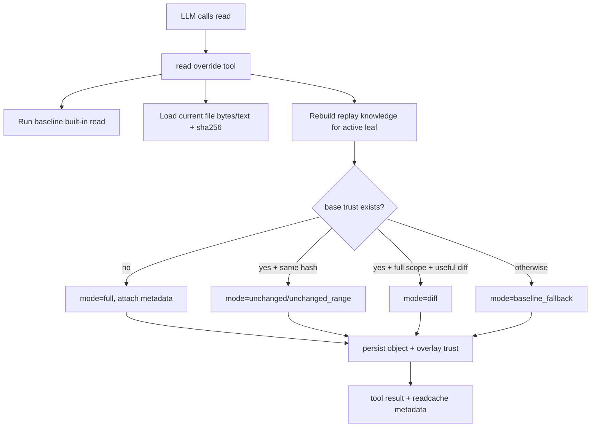
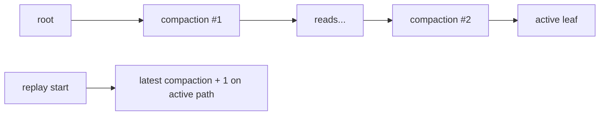

# 🧠 pi-readcache

[](https://pi.dev/)
[](https://www.npmjs.com/package/pi-readcache)
[](LICENSE)

A pi extension that overrides the built-in `read` tool with hash-based, replay-aware caching.

It reduces token usage and context bloat from repeated file reads while preserving correctness as session state evolves.

Correctness is maintained across:
- range reads (`path:START-END`)
- tree navigation (`/tree`)
- compaction boundaries
- restart/resume replay

## What you get

`pi-readcache` runs automatically in the background by overriding `read` and managing replay trust for you. Refresh/invalidation can also be triggered by the model itself via the `readcache_refresh` tool when it decides a fresh baseline is needed. You can still run `/readcache-refresh` manually for explicit control.

When the extension is active, `read` may return:
- full content (`mode: full`)
- unchanged marker (`mode: unchanged`)
- unchanged range marker (`mode: unchanged_range`)
- unified diff for full-file reads (`mode: diff`)
- baseline fallback (`mode: baseline_fallback`)

Plus:
- `/readcache-status` to inspect replay/coverage/savings
- `/readcache-refresh <path> [start-end]` to invalidate trust for next read
- `readcache_refresh` tool (same semantics as command)

## Install

Preferred (npm):

```bash
pi install npm:pi-readcache
```

Alternative (git):

```bash
pi install git:https://github.com/Gurpartap/pi-readcache
```

After installation, you can use pi normally. If pi is already running when you install or update, run `/reload` in that session.

## Day-to-day usage

| Action | Command | Expected result |
|---|---|---|
| Baseline read | `read src/foo.ts` | `mode: full` or `mode: baseline_fallback` |
| Repeat read (no file change) | `read src/foo.ts` | `[readcache: unchanged, ...]` |
| Range read | `read src/foo.ts:1-120` | `mode: full`, `baseline_fallback`, or `unchanged_range` |
| Inspect replay/cache state | `/readcache-status` | tracked scopes, replay window, mode counts, estimated savings |
| Invalidate full scope | `/readcache-refresh src/foo.ts` | next full read re-anchors |
| Invalidate range scope | `/readcache-refresh src/foo.ts 1-120` | next range read re-anchors |

## Important behavior notes

- Sensitive-path bypass: readcache does not cache/diff these patterns and falls back to baseline `read` output: `.env*`, `*.pem`, `*.key`, `*.p12`, `*.pfx`, `*.crt`, `*.cer`, `*.der`, `*.pk8`, `id_rsa`, `id_ed25519`, `.npmrc`, `.netrc`.
- Compaction is a strict replay barrier for trust reconstruction:
  - replay starts at the latest active `compaction + 1`.
  - pre-compaction trust is not used after that barrier.
- First read after that barrier for a path/scope will re-anchor with baseline (`full`/`baseline_fallback`).
- For exact current file text, the assistant should still perform an actual `read` in current context.

---

## For extension developers (and curious cats)

## Design docs

- [IMPLEMENTATION_SPEC.md](IMPLEMENTATION_SPEC.md)
- [IMPLEMENTATION_PLAN.md](IMPLEMENTATION_PLAN.md)
- [EVOLUTION_PLAN_1.md](EVOLUTION_PLAN_1.md)
- [EVOLUTION_PLAN_2.md](EVOLUTION_PLAN_2.md)

## High-level architecture



## Runtime model

- Trust key: `(pathKey, scopeKey)` where scope is:
  - `full`
  - `r:<start>:<end>`
- Trust value: `{ hash, seq }`
- Replay source:
  - prior `read` tool result metadata (`details.readcache`)
  - custom invalidation entries (`customType: "pi-readcache"`)
- Overlay:
  - in-memory, per `(sessionId, leafId)`, high seq namespace for same-turn freshness

## Compaction/tree semantics



Rules:
- replay boundary = latest compaction on active branch path + 1
- if no compaction on path, replay starts at root
- tree/fork/switch/compact/shutdown clear in-memory memo/overlay caches

## File map

- `index.ts` - extension entrypoint + lifecycle reset hooks
- `src/tool.ts` - `read` override decision engine
- `src/replay.ts` - replay reconstruction, trust transitions, overlay
- `src/meta.ts` - metadata/invalidation validators and extractors
- `src/commands.ts` - `/readcache-status`, `/readcache-refresh`, `readcache_refresh`
- `src/object-store.ts` - content-addressed storage (`.pi/readcache/objects`)
- `src/diff.ts` - unified diff creation + usefulness gating
- `src/path.ts` - path/range parsing and normalization
- `src/telemetry.ts` - replay window/mode/savings reporting

## Tool-override compatibility contract

Because this overrides built-in `read`, it must preserve:
- same tool name + parameters (`path`, `offset?`, `limit?`)
- baseline-compatible content shapes (including image passthrough)
- truncation behavior and `details.truncation` compatibility

## Development

```bash
npm install
npm run typecheck
npm test
```

Targeted suites:

```bash
npm test -- test/unit/replay.test.ts
npm test -- test/integration/compaction-boundary.test.ts
npm test -- test/integration/tree-navigation.test.ts
npm test -- test/integration/selective-range.test.ts
npm test -- test/integration/refresh-invalidation.test.ts
npm test -- test/integration/restart-resume.test.ts
```

## License
MIT © 2026 Gurpartap Singh (https://x.com/Gurpartap)
